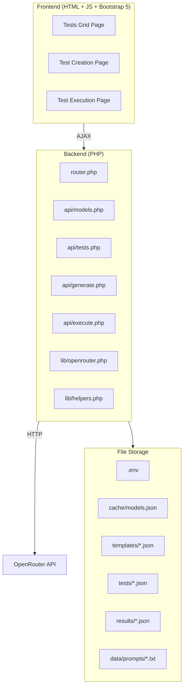
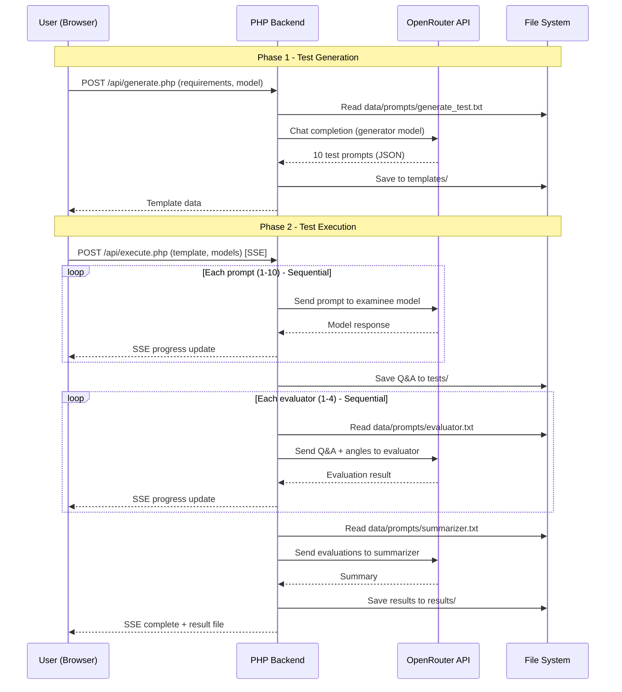

## Objective

Build a web-based AI model testing platform with three core pages: Tests Grid, Test Creation, and Test Execution. The platform uses OpenRouter API for model interactions, PHP backend, and plain JS frontend with Bootstrap 5.

---

## Architecture Overview



---

## Directory Structure

```
E:\projects\model-test\
├── .env                          # OPENROUTER_API_KEY
├── run_server.bat                # PHP dev server launcher
├── router.php                    # Request router for PHP built-in server
├── index.html                    # Main SPA shell (tab-based navigation)
│
├── assets/
│   ├── css/
│   │   └── app.css               # Custom styles
│   └── js/
│       ├── app.js                # Main app init, navigation, model cache
│       ├── grid.js               # Tests grid page logic
│       ├── create.js             # Test creation page logic
│       ├── execute.js            # Test execution page logic
│       └── autocomplete.js       # Reusable autocomplete component
│
├── api/
│   ├── models.php                # GET: list models (cached)
│   ├── tests.php                 # CRUD for test templates
│   ├── generate.php              # POST: generate test via AI
│   ├── execute.php               # POST: execute test (sequential calls)
│   └── results.php               # GET: fetch results
│
├── lib/
│   ├── openrouter.php            # OpenRouter API client (with retry logic)
│   └── helpers.php               # Shared utilities (file ops, env loading)
│
├── data/
│   └── prompts/
│       ├── generate_test.txt     # Prompt template for test generation
│       ├── evaluator.txt         # Prompt template for evaluators
│       └── summarizer.txt        # Prompt template for summary/final evaluation
│
├── cache/
│   └── models.json               # Cached OpenRouter models list
│
├── templates/                    # Generated test templates
│   └── *.json
│
├── tests/                        # Test execution results (Q&A)
│   └── *.json
│
└── results/                      # Evaluation results
    └── *.json
```

---

## Step-by-Step Implementation

### Step 1: Project Scaffolding & Core Infrastructure

**Targets:** `.env`, `router.php`, `lib/helpers.php`, `lib/openrouter.php`, directory creation

- Create `.env` file with `OPENROUTER_API_KEY=<key>` placeholder
- Create `router.php` - PHP built-in server router that:
  - Serves static files (HTML, CSS, JS) directly
  - Routes `/api/*` requests to corresponding PHP files
- Create `lib/helpers.php`:
  - `load_env()` - parse `.env` file
  - `json_response($data, $code)` - standardized JSON responses
  - `read_json_file($path)` / `write_json_file($path, $data)`
  - `safe_filename($name)` - sanitize filenames
- Create `lib/openrouter.php`:
  - `get_api_key()` - load key from `.env`
  - `chat_completion($model, $messages, $options)` - send chat request to `https://openrouter.ai/api/v1/chat/completions`
  - **Sequential execution with retry**: max 3 retries per request, exponential backoff (1s, 2s, 4s), validate HTTP status before proceeding
  - `fetch_models()` - GET `https://openrouter.ai/api/v1/models`
- Create required directories: `cache/`, `templates/`, `tests/`, `results/`, `data/prompts/`, `assets/css/`, `assets/js/`, `api/`, `lib/`
- Update `run_server.bat` to use `router.php`

**Verification:** PHP server starts, `/api/models` returns model list or error message.

---

### Step 2: Models Cache & API Endpoint

**Targets:** `api/models.php`, `cache/models.json`

- `api/models.php` (GET):
  - Check if `cache/models.json` exists and is less than 24 hours old
  - If cache valid: return cached data
  - If cache expired/missing: call `fetch_models()`, save to `cache/models.json`, return data
  - Store only essential fields per model: `id`, `name`, `pricing.prompt`, `pricing.completion`, `context_length`, `description`
  - Support `?refresh=1` query param to force refresh

**Verification:** `GET /api/models.php` returns JSON array of models; second call is instant (cached).

---

### Step 3: Prompt Templates (data/prompts/)

**Targets:** `data/prompts/generate_test.txt`, `data/prompts/evaluator.txt`, `data/prompts/summarizer.txt`

- **`generate_test.txt`** - Prompt for AI test generation:
  - Instructs the model to generate exactly 10 test prompts based on provided requirements
  - Each prompt tests one or more requirements independently
  - Output format: JSON with `title` (auto-generated test title) and `prompts` array (10 objects with `id`, `prompt`, `tested_requirements`)
  - Includes instruction to return valid JSON only, no markdown wrapping

- **`evaluator.txt`** - Prompt for evaluator models:
  - Receives: the test Q&A pairs + evaluation angles
  - Instructs: evaluate each answer against the evaluation angles
  - Output format: JSON with per-question scores and comments, plus overall score (1-10 scale)

- **`summarizer.txt`** - Prompt for summary model:
  - Receives: all evaluator results
  - Instructs: synthesize a unified evaluation report
  - Output format: JSON with overall assessment, strengths, weaknesses, per-question consensus, and final score

**Verification:** Files exist and contain well-structured prompt templates.

---

### Step 4: Main HTML Shell & Navigation

**Targets:** `index.html`, `assets/css/app.css`, `assets/js/app.js`

- `index.html`:
  - Bootstrap 5 CDN (CSS + JS bundle)
  - Tab-based SPA navigation (3 tabs: Tests Grid, Create Test, Execute Test)
  - Each tab loads its content section (shown/hidden)
  - Include all JS files at bottom

- `assets/css/app.css`:
  - Custom styles for autocomplete dropdown, test cards, result display, loading states
  - RTL-safe (English UI but clean structure)

- `assets/js/app.js`:
  - On page load: fetch and cache models from `/api/models.php`
  - Store models in `window.modelsCache` for all pages
  - Tab navigation handler
  - Model preset configurations:
    - **Performance**: `google/gemini-2.5-pro`, `anthropic/claude-sonnet-4`, `openai/gpt-4.1`, `deepseek/deepseek-r1` (evaluators) + `anthropic/claude-sonnet-4` (summarizer)
    - **Standard**: `google/gemini-2.5-flash`, `anthropic/claude-3.5-haiku`, `openai/gpt-4.1-mini`, `deepseek/deepseek-chat` (evaluators) + `google/gemini-2.5-flash` (summarizer)
    - **Economy**: `google/gemini-2.0-flash-lite`, `meta-llama/llama-3.1-8b-instruct`, `mistralai/mistral-small-3.1-24b-instruct`, `qwen/qwen-2.5-7b-instruct` (evaluators) + `google/gemini-2.0-flash-lite` (summarizer)
  - Shared utility functions: `showLoading()`, `hideLoading()`, `showAlert()`, `formatDate()`

**Verification:** Page loads, tabs switch, models cache populated.

---

### Step 5: Autocomplete Component

**Targets:** `assets/js/autocomplete.js`

- Reusable autocomplete class: `ModelAutocomplete(inputElement, options)`
  - Filters `window.modelsCache` by typed text (searches `id` and `name`)
  - Shows dropdown with model name, id, and pricing info
  - Keyboard navigation (arrow keys + Enter)
  - Click to select
  - `onSelect(model)` callback
  - `setValue(modelId)` / `getValue()` methods
  - Debounced input (150ms)
  - Max 20 results shown at a time

**Verification:** Typing in any model input shows filtered suggestions, selection populates the field.

---

### Step 6: Tests Grid Page

**Targets:** `assets/js/grid.js`, `api/tests.php`

- `api/tests.php`:
  - `GET` - List all templates from `templates/` directory, return array with metadata
  - `GET ?id=filename` - Return specific template details
  - `PUT` - Update existing template (edit)
  - `POST ?action=revision` - Create new revision of template (copy with new filename suffix)
  - `DELETE ?id=filename` - Delete template

- `assets/js/grid.js`:
  - Fetch and display all test templates in a Bootstrap table
  - Columns: Title, Prompts Count, Created Date, Actions
  - Actions per row:
    - **View** - Modal showing full test details (prompts list, requirements, evaluation angles)
    - **Edit** - Modal with editable fields (title, individual prompts, requirements, evaluation angles)
    - **Revision** - Creates a copy as new revision, opens edit modal
    - **Execute** - Switches to Execute Test tab with this template pre-selected
    - **Create New** - Button that switches to Create Test tab
  - Search/filter functionality on the table

**Verification:** Grid shows all templates, all CRUD actions work, navigation to other tabs works.

---

### Step 7: Test Creation Page

**Targets:** `assets/js/create.js`, `api/generate.php`

- `api/generate.php` (POST):
  - Receives: `{ requirements: string, evaluation_angles: string, model: string, title: string }`
  - Loads `data/prompts/generate_test.txt`, injects `requirements` into the template
  - Calls OpenRouter chat completion with the selected model
  - Parses JSON response (with fallback: extract JSON from markdown code blocks if wrapped)
  - Saves to `templates/{sanitized_title}_{last4digits_of_timestamp}.json` with structure:
    ```json
    {
      "title": "...",
      "requirements": "...",
      "evaluation_angles": "...",
      "generator_model": "...",
      "created_at": "...",
      "prompts": [
        { "id": 1, "prompt": "...", "tested_requirements": "..." },
        ...
      ]
    }
    ```
  - Returns saved template data + filename

- `assets/js/create.js`:
  - Textarea 1: Requirements (what the test should verify)
  - Textarea 2: Evaluation angles (criteria for scoring)
  - Model selector (autocomplete) for the generator model
  - Text input: Test title
  - "Generate" button:
    - Shows loading spinner with progress text
    - Calls `/api/generate.php`
    - On success: displays generated prompts in a preview area
    - User can edit individual prompts before final save
  - "Save" button (after preview): confirms save, redirects to grid

**Verification:** Fill requirements, select model, generate produces 10 prompts, saves to templates/.

---

### Step 8: Test Execution Page

**Targets:** `assets/js/execute.js`, `api/execute.php`, `api/results.php`

- **UI Layout:**
  - Dropdown: Select test template (populated from templates/)
  - Autocomplete: Select model to test (the "examinee")
  - Preset buttons row: **Performance** | **Standard** | **Economy**
  - 4 Autocomplete inputs: Evaluator models (pre-filled by preset)
  - 1 Autocomplete input: Summarizer model (pre-filled by preset)
  - **"Run Test"** button
  - Progress section: shows current step, progress bar, live status
  - Results section: collapsible panels for each question

- `api/execute.php` (POST) - **Three-phase sequential execution:**

  **Phase 1 - Model Testing (Sequential):**
  - For each of the 10 prompts, sequentially:
    - Send prompt to the examinee model via OpenRouter
    - Retry up to 3 times on failure (exponential backoff)
    - Append Q&A to results array
    - Return progress via response (or use polling endpoint)
  - Save to `tests/{template_title}_{model_name}_V{n}.json`:
    ```json
    {
      "template": "...",
      "model": "...",
      "version": 1,
      "created_at": "...",
      "qa_pairs": [
        { "id": 1, "prompt": "...", "response": "...", "status": "success" },
        ...
      ]
    }
    ```
  - Version detection: if file exists, increment V number

  **Phase 2 - Evaluation (Sequential per evaluator):**
  - For each of the 4 evaluator models, sequentially:
    - Load evaluator prompt from `data/prompts/evaluator.txt`
    - Inject: Q&A pairs + evaluation angles
    - Send to evaluator model
    - Retry up to 3 times on failure
    - Collect evaluation result
  - Save all evaluations to `results/{same_base_name}.json`:
    ```json
    {
      "test_file": "...",
      "evaluations": [
        {
          "evaluator_model": "...",
          "scores": [...],
          "overall_score": 8.5,
          "comments": "..."
        },
        ...
      ]
    }
    ```

  **Phase 3 - Summary (Single call):**
  - Load summarizer prompt from `data/prompts/summarizer.txt`
  - Inject all evaluator results
  - Send to summarizer model
  - Append summary to the results file:
    ```json
    {
      "summary": {
        "model": "...",
        "overall_assessment": "...",
        "strengths": [...],
        "weaknesses": [...],
        "final_score": 8.2,
        "per_question_consensus": [...]
      }
    }
    ```

- **Execution approach:** Single long POST request with **SSE (Server-Sent Events)** to stream progress updates to the frontend in real-time:
  - `{"phase": "testing", "step": 3, "total": 10, "status": "sending prompt 3..."}`
  - `{"phase": "evaluating", "step": 2, "total": 4, "model": "..."}`
  - `{"phase": "summarizing", "status": "generating summary..."}`
  - `{"phase": "complete", "result_file": "..."}`

- `api/results.php` (GET):
  - `?file=filename` - Return full result data
  - `?list=1` - List all results with metadata

- **Frontend results display:**
  - Accordion/tabs for each question showing: prompt, model response
  - Section for each evaluator's scores and comments
  - Final summary card with overall score, strengths, weaknesses

**Verification:** Full end-to-end test: select template, select models, run test, see progressive updates, view complete report.

---

### Step 9: Results Display in Grid

**Targets:** Update `assets/js/grid.js`

- Add "Results" column to grid showing count of completed test runs
- Click to see list of all runs for that template
- Each run links to full report view (reuses execute page report section)

**Verification:** Grid shows result counts, clicking opens result reports.

---

## Data Flow Diagram



---

## Key Technical Decisions

| Concern | Decision |
|---------|----------|
| API Calls | **Sequential** (not parallel) to avoid rate limits and ensure reliability |
| Retry Logic | Max 3 retries, exponential backoff (1s, 2s, 4s), log failures |
| Progress Updates | SSE (Server-Sent Events) for real-time frontend updates |
| Model Selection | Autocomplete with debounced search over cached models |
| File Naming | `{title}_{last4_timestamp}.json` to avoid collisions |
| Versioning | Auto-increment `_V{n}` suffix for repeated test executions |
| Prompts | All AI prompts stored in `data/prompts/*.txt`, never hardcoded |
| JSON Parsing | Fallback regex extraction if model wraps JSON in markdown blocks |

---

## Verification / Definition of Done

| Step | Targets | Verification |
|------|---------|-------------|
| 1 | `.env`, `router.php`, `lib/*` | Server starts, API routes work |
| 2 | `api/models.php`, `cache/` | Models returned, caching works |
| 3 | `data/prompts/*` | Prompt files exist with proper templates |
| 4 | `index.html`, `app.js`, `app.css` | Page loads, tabs navigate, models cached |
| 5 | `autocomplete.js` | Type-to-search works, selection populates field |
| 6 | `grid.js`, `api/tests.php` | CRUD operations on templates work |
| 7 | `create.js`, `api/generate.php` | Generate 10 prompts, save to templates/ |
| 8 | `execute.js`, `api/execute.php`, `api/results.php` | Full 3-phase execution with SSE progress, results saved and displayed |
| 9 | `grid.js` update | Results count visible, report links work |

